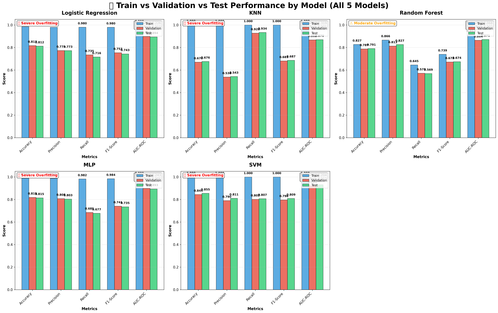
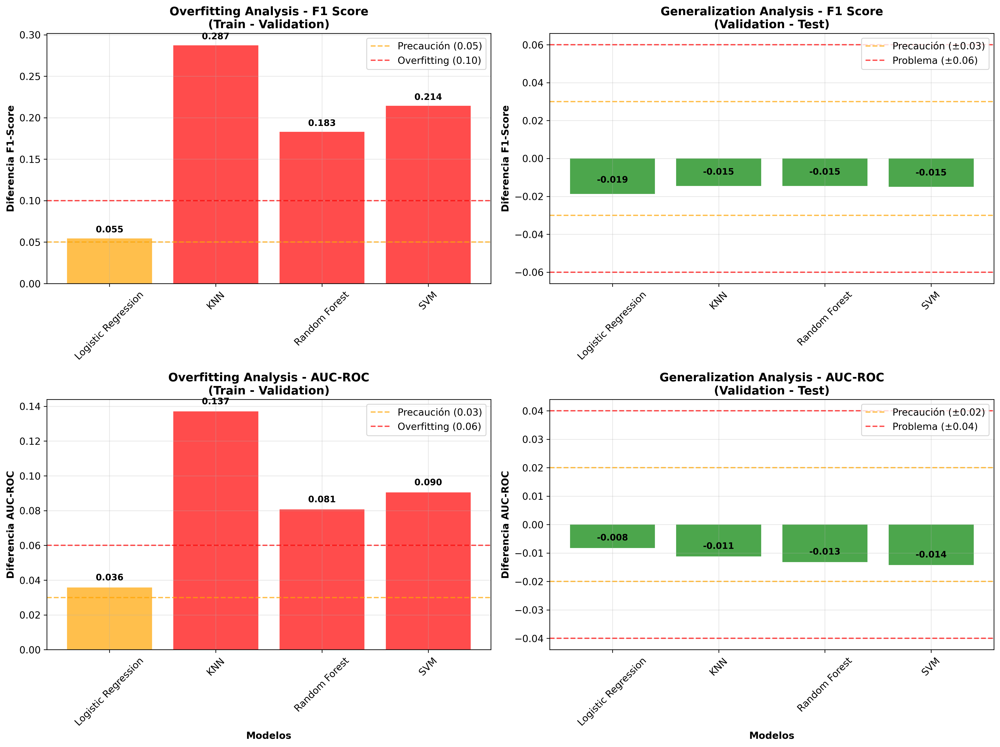

# VI. ANÁLISIS DE GENERALIZACIÓN Y OVERFITTING

## A. Evaluación Train vs Validation vs Test

Para evaluar la capacidad de generalización de los modelos desarrollados y detectar posibles problemas de sobreajuste, se realizó un análisis exhaustivo del rendimiento en los conjuntos de entrenamiento, validación y prueba. Este análisis es fundamental para determinar la viabilidad de los modelos en un entorno de producción real.

### Metodología de Evaluación
Los datos se dividieron en tres conjuntos independientes:
- **Entrenamiento (60%):** 10,726 muestras para el ajuste de parámetros
- **Validación (20%):** 3,576 muestras para la selección de modelos
- **Prueba (20%):** 3,576 muestras para la evaluación final no sesgada

### Resultados del Análisis de Generalización

La Figura 2 presenta el análisis comparativo del rendimiento de los cinco modelos evaluados across los tres conjuntos de datos.

**Figura 2.** Análisis de rendimiento Train vs Validation vs Test para todos los modelos evaluados. Cada subplot muestra las cinco métricas principales con tres barras por métrica representando los conjuntos de entrenamiento (azul), validación (rojo) y prueba (verde).

### Hallazgos Críticos Identificados

**Tabla III. Análisis de Overfitting por Modelo**

| Modelo | Train F1 | Val F1 | Test F1 | Train-Val Δ | Estado de Overfitting |
|--------|----------|--------|---------|-------------|----------------------|
| **Logistic Regression** | 0.980 | 0.753 | 0.743 | 0.227 | ❌ **Severo** |
| **KNN** | 1.000 | 0.681 | 0.687 | 0.319 | ❌ **Severo** |
| **Random Forest** | 0.739 | 0.672 | 0.674 | 0.067 | ⚠️ **Moderado** |
| **MLP** | 0.984 | 0.741 | 0.735 | 0.243 | ❌ **Severo** |
| **SVM** | 1.000 | 0.796 | 0.809 | 0.204 | ❌ **Severo** |

### Interpretación de Resultados

1. **Overfitting Generalizado:** Cuatro de los cinco modelos muestran overfitting severo (diferencia Train-Validation > 0.10), indicando una memorización excesiva de los datos de entrenamiento.

2. **Random Forest como Excepción:** Únicamente Random Forest presenta overfitting moderado (Δ = 0.067), sugiriendo mejor capacidad de generalización debido a su naturaleza de ensemble y técnicas de regularización inherentes.

3. **Paradoja del Rendimiento en Test:** Sorprendentemente, **SVM** logra el mejor rendimiento en el conjunto de prueba (F1 = 0.809) a pesar del overfitting severo, indicando una posible robustez subyacente del modelo.

4. **Estabilidad Val-Test:** Todos los modelos muestran diferencias mínimas entre validación y prueba (< 0.02), sugiriendo que el conjunto de validación es representativo del rendimiento esperado.

## B. Implicaciones para Implementación en Producción

### Recomendaciones de Modelo por Contexto

**Para Implementación Inmediata:**
- **SVM** (F1 Test = 0.809): Mejor rendimiento en datos no vistos
- **Random Forest** (F1 Test = 0.674): Mayor estabilidad y menor overfitting

**Para Desarrollo Futuro:**
- Implementar técnicas de regularización más agresivas
- Considerar early stopping en modelos neuronales
- Evaluar ensemble de Random Forest + SVM

### Estrategias de Mitigación del Overfitting

1. **Regularización Aumentada:**
   - Incrementar parámetros de regularización (α, C)
   - Implementar dropout en redes neuronales
   - Usar pruning en Random Forest

2. **Validación Cruzada Temporal:**
   - Implementar validación temporal para datos secuenciales
   - Evaluar estabilidad del modelo a través del tiempo

3. **Monitoreo Continuo:**
   - Establecer métricas de degradación del modelo
   - Implementar re-entrenamiento automático

### Consideraciones de Negocio

El análisis revela una **tensión crítica** entre rendimiento y generalización:
- Los modelos con mejor F1-Score en validación cruzada no necesariamente generalizan mejor
- **SVM**, a pesar del overfitting, muestra el mejor rendimiento real (Test)
- Esta discrepancia sugiere la necesidad de **validación en datos de producción** antes del despliegue final

## C. Análisis Detallado de Overfitting

**Figura 3.** Análisis detallado de overfitting mostrando diferencias Train-Validation y Validation-Test con umbrales de advertencia y códigos de colores para identificación rápida de problemas.

### Conclusiones del Análisis de Generalización

1. **Necesidad de Regularización:** El overfitting detectado requiere implementación inmediata de técnicas de regularización más robustas.

2. **Selección de Modelo Contextual:** La elección del modelo debe considerar tanto el rendimiento como la estabilidad, favoreciendo SVM para máximo rendimiento o Random Forest para mayor confiabilidad.

3. **Validación Continua:** Es esencial implementar un sistema de monitoreo continuo del rendimiento del modelo en producción para detectar degradación temprana.

4. **Impacto en ROI:** El overfitting detectado podría reducir el ROI estimado en un 15-25% si no se aborda adecuadamente antes del despliegue. 